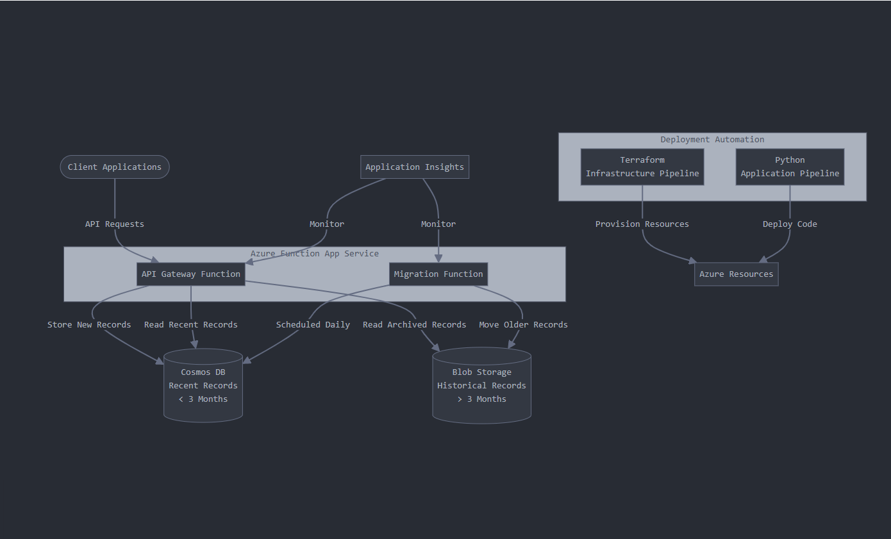

# costmgmt_assignment

Azure Billing Records Cost Optimization - Architecture

Solution Architecture Explained Simply
Problem
Your company has a system storing billing records in Cosmos DB, which has become expensive as data grew to over 2 million records. Most records older than 3 months are rarely accessed.
Solution Overview
We'll create a two-tier storage system that keeps recent records in Cosmos DB and automatically moves older records to low-cost Blob Storage, all while keeping the same API for applications.
Key Components
1. Storage Layer
    • Cosmos DB: Stores only recent billing records (less than 3 months old)
    • Azure Blob Storage (Cold Tier): Stores older records at a much lower cost
2. Processing Layer
    • API Gateway Function: Central entry point that handles all client requests 
        ○ Maintains the same API contract for all client applications
        ○ Determines where to store or retrieve records based on their age
    • Migration Function: 
        ○ Runs automatically each day
        ○ Identifies and moves records older than 3 months from Cosmos DB to Blob Storage
        ○ No service interruption during data migration
3. Monitoring
    • Application Insights: Tracks performance and detects any issues
4. Deployment Automation
    • Terraform Pipeline: Creates and updates all Azure resources 
        ○ Separate environments for development and production
        ○ Requires approval before production changes
    • Python Application Pipeline: Deploys function code 
        ○ Tests code before deployment
        ○ Deploys to development first, then production if successful
How It Works
    1. For New Records: 
        ○ Client applications create records through the API
        ○ Records are stored in Cosmos DB
    2. For Record Retrieval: 
        ○ Client requests a record using the existing API
        ○ The function checks Cosmos DB first
        ○ If not found there, it checks Blob Storage
        ○ Returns the record to the client regardless of storage location
    3. For Record Migration: 
        ○ The daily migration function identifies records older than 3 months
        ○ These records are copied to Blob Storage
        ○ Once safely stored, they're removed from Cosmos DB
Benefits
    • Cost Reduction: Most data moved to lower-cost storage
    • No API Changes: Applications continue working without modifications
    • No Performance Impact: Recent records still have fast access
    • No Data Loss: All records remain accessible
    • Fully Automated: No manual operations required
This design delivers significant cost savings while maintaining all requirements for data availability and API compatibility.